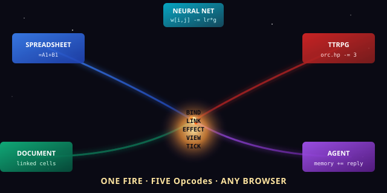
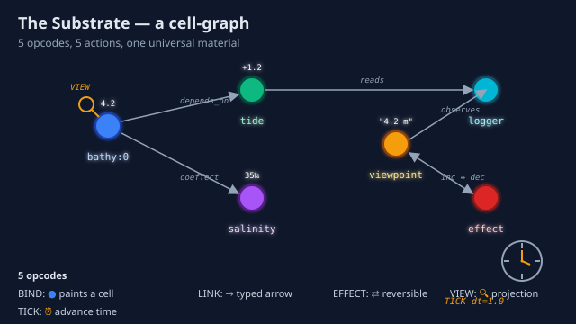
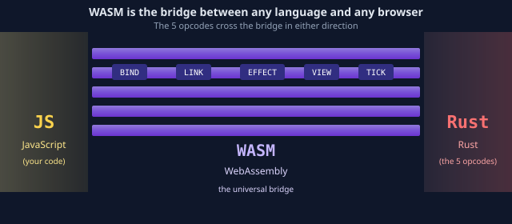

# quilt-vm-wasm

> **The 5 opcodes that power every spreadsheet, TTRPG, and neural
> net — now running in your browser.**

[](https://webassembly.org/)
[](#the-five-words)
[](#what-is-the-substrate)
[](LICENSE)

<p align="center">
  
</p>

## Read This If You Are New

Skip everything below the **TL;DR** and just do this:

```bash
git clone https://github.com/SuperInstance/quilt-vm-wasm
cd quilt-vm-wasm
wasm-pack build --target web
python3 -m http.server 8000 --directory www
# open http://localhost:8000
```

Click **Run Gold Demo** in the page. You will see five
tendrils of light — one for a bathy reading, one for a MUD
character, one for a spreadsheet cell, one for a TTRPG orc,
one for a chat agent — all come out of the same five words
on the page. That is the whole point of the project. The
**5 opcodes are universal** and they run in your browser
because WASM is the universal machine code.

If you only have **30 seconds**, read the next two sections.

---

## TL;DR (30 seconds)

A spreadsheet has cells. A TTRPG has characters. A database
has tables. A neural net has tensors. A chat agent has
memory. **They are all the same thing** under the hood:
a *cell-graph* — a set of named things (cells) and the
*typed relations* (links) between them, with a clock that
advances the world one tick at a time.

This repo gives you **5 words** that work on that graph:

| Word | What it does | Spreadsheet version | TTRPG version | Neural net version |
|------|--------------|---------------------|---------------|--------------------|
| **BIND** | Make a thing | a cell | a character | a tensor |
| **LINK** | Connect two things | a formula | a sword | a weight |
| **EFFECT** | Change it, with an undo | paste, with undo | an attack, with parry | a gradient step |
| **VIEW** | Read it from somewhere | =A1 in a formula | a perception check | a forward pass |
| **TICK** | Advance time | recalculate | end the round | step the optimizer |

The same 5 words. They run in C, Rust, Python, TypeScript,
Haskell, and now — **in any browser via WebAssembly**.

---

## TL;DR (5 minutes)

The whole story is here:

> A runtime is a function from context to value with an
> inverse, advanced by a clock that processes async I/O
> while projecting a sync view.

That's it. Five opcodes cover that sentence.

- **BIND** = the function (a thing with a value)
- **LINK** = the context (the function's inputs, expressed
  as typed references)
- **EFFECT** = the inverse (an undo for every change)
- **VIEW** = the projection (who sees what, and how)
- **TICK** = the clock (advance time, one step at a time)

Every program that ever existed is doing some combination of
those five things. So instead of writing 200 different
spreadsheets, TTRPG engines, neural nets, and chat agents,
we write **one runtime** and let the 5 opcodes be its
voice.

This repo is the **WASM compilation of that voice**. It
runs in any modern browser. The 5 opcodes are
JavaScript-callable. You can `import` them like any other
module.

```javascript
import init, { WasmQuiltVM } from "./pkg/quilt_vm_wasm.js";
await init();
const vm = new WasmQuiltVM();

vm.bind("bathy:0", 4.2);                  // BIND: "the water is 4.2 m deep"
vm.link("bathy:0", "tide:current",        // LINK: "the depth depends on the tide"
        "depends_on");
console.log(vm.view("bathy:0", "anyone"));  // VIEW: "anyone can see 4.2"
vm.tick(1.0);                              // TICK: "1 second passes"
```

That's a working program. It runs in a browser tab, with
no server.

---

## What Is the Substrate? (the deeper one)

<p align="center">
  
</p>

Look at the diagram. Five opcodes:

1. **BIND** paints a dot. The dot has a name and a value.
   `BIND("bathy:0", 4.2)` paints a dot named "bathy:0"
   with the value `4.2`. In a spreadsheet, this is **a
   cell**. In a TTRPG, this is **a character**. In a
   neural net, this is **a tensor**.

2. **LINK** draws an arrow between two dots. The arrow
   has a *type*: `depends_on`, `fights`, `cites`,
   `is_parent_of`, anything. The arrow is **typed**:
   "this cell depends on that cell" is different from
   "this cell equals that cell". A spreadsheet calls
   this a **formula**. A TTRPG calls it an **acquaintance**.
   A neural net calls it a **weight**. A database calls
   it a **foreign key**.

3. **EFFECT** draws a *two-headed* arrow. The forward
   head does the change. The inverse head undoes it.
   This is **the secret sauce**. Every change in the
   substrate is reversible. So `paste` has `undo`.
   `attack` has `parry`. `gradient step` has
   `gradient descent on the previous step`. **You can
   always go back.** That's what makes the substrate
   safe. It also makes it **transactional** — and a
   spreadsheet that can undo is a *database*; a database
   that can undo is a *version control system*; a
   version control system that can branch is *git*.

4. **VIEW** is a magnifying glass over a dot. Who is
   looking? What do they see? `VIEW("bathy:0",
   "anyone")` returns the value `4.2`. But `VIEW("bathy:0",
   "anyone", projection="formatted")` might return
   `"4.2 m"`. The view-projection is the **access control**
   and the **formatting** in one. A spreadsheet calls
   this a **formula chain**. A TTRPG calls it a
   **perception check**. A neural net calls it a
   **forward pass through this layer**. A database calls
   it a **SELECT**.

5. **TICK** is a clockwork in the corner of the page.
   The clock advances time. When it ticks, all the
   pending effects run, all the views recalculate, all
   the subscribers wake up. The tick is the **scheduler**.
   The cell-graph is alive because of the tick.

These five pictures, painted together, are **every
program that has ever been written**. They are also
**the substrate** — the material all programs are made of.

---

## The 5 Opcodes, In One Picture

```
                    ┌─────────────────────────────────────┐
                    │            THE SUBSTRATE            │
                    │         a cell-graph runtime        │
                    │                                     │
                    │   • • • • •  (cells, named things)  │
                    │   ↓ ↑ ↔ ↕  (links, typed arrows)    │
                    │   ⇄  ⇄  ⇄   (effects, reversible)    │
                    │   🔍 🔍      (views, projections)   │
                    │   ⏰           (tick, the clock)     │
                    └─────────────────────────────────────┘
                                    │
   BIND  ── paints a dot           │
   LINK  ── draws an arrow         │
   EFFECT ── draws a 2-way arrow   │  all five
   VIEW  ── holds up a glass       │  live in
   TICK  ── winds the clock        │  your browser
                                    │  via WASM
```

---

## Why WASM, Specifically

<p align="center">
  
</p>

WebAssembly is **the universal machine code** for the
web. It is what you compile to when you want a program
to run in any browser on any operating system on any
device — phone, laptop, server — without installing
anything.

The 5 opcodes already run in **C, Rust, Python, Haskell,
TypeScript**. WASM is the **sixth** place they live. By
running in WASM, they:

- Run in any browser tab (no install, no server)
- Run in Node.js (server-side JS, with the same code)
- Run on edge platforms (Cloudflare Workers, Fastly Compute)
- Run on IoT devices that have WASM runtimes (ESP32-WASM,
  embedded WASM)
- Are the **bytecode of the substrate** — any other
  language can compile to WASM and talk to the same
  5 opcodes

So the WASM port isn't just "another language". It's
**the lingua franca**. WASM is the language every cell
graph speaks when it crosses platform boundaries.

---

## How This Repo Fits the Polyformalism

The 5 opcodes are a **polyformalism** — the same thing
in many forms. Here is the 5x5 grid (see Paper 142 for
the full 7xN grid):

```
              Rust  C  Python  TypeScript  Haskell  WASM  ...
BIND           ✓    ✓    ✓       ✓          ✓       ✓   ← you are here
LINK           ✓    ✓    ✓       ✓          ✓       ✓
EFFECT         ✓    ✓    ✓       ✓          ✓       ✓
VIEW           ✓    ✓    ✓       ✓          ✓       ✓
TICK           ✓    ✓    ✓       ✓          ✓       ✓
```

The same five words. The same runtime. The substrate is
universal; the grammar is local.

This is **Layer 1 of the polyformalism stack**. The
other layers:

- **Layer 2 (types)** — [quilt-types](https://github.com/SuperInstance/quilt-types) — the 5 opcodes as typed Python dataclasses
- **Layer 3 (linker)** — [quilt-linker](https://github.com/SuperInstance/quilt-linker) — the 5 opcodes as a link-time checker
- **Layer 4 (optimizer)** — [quilt-opt](https://github.com/SuperInstance/quilt-opt) — the 5 opcodes as algebraic optimization passes
- **Layer 5 (GC)** — [quilt-gc](https://github.com/SuperInstance/quilt-gc) — the 5 opcodes as a garbage-collector
- **Layer 6 (language syntax)** — [quilt-polyformalism-dsl](https://github.com/SuperInstance/quilt-polyformalism-dsl) — the 5 opcodes as decorators / typeclasses
- **Layer 7 (human grammar)** — [ai-writings](https://github.com/SuperInstance/AI-Writings) — the 5 opcodes in 9+ languages

WASM is **Layer 1** because it's the lowest-level
materialization: the substrate compiled to **machine
code that runs everywhere**.

---

## The 5 Opcodes, In Detail (for advanced users)

### BIND — make a thing

```rust
vm.bind("bathy:0", serde_json::json!(4.2));
```

BIND puts a value at a name. The name is a string. The
value is anything JSON-serializable. The cell exists
until you TICK it past its lifetime (GC) or you drop
the VM. BIND is **the only way to create a cell**. There
is no "pre-existing" cell; everything is BIND.

**Spreadsheet equivalent:** typing `4.2` into cell A1.
**TTRPG equivalent:** making a character sheet.
**Database equivalent:** `INSERT INTO bathy VALUES (4.2)`.
**Neural net equivalent:** `tensor = torch.zeros(...)`.

### LINK — connect two things

```rust
vm.link("bathy:0", "tide:current", "depends_on");
```

LINK draws a typed arrow from one cell to another. The
relation is a string. The arrow is one-way unless you
also LINK the other direction.

**Spreadsheet equivalent:** `=B1` in cell A1. **TTRPG
equivalent:** Gandalf's relationship to the One Ring.
**Database equivalent:** FOREIGN KEY constraint.
**Neural net equivalent:** a weight between two layers.

### EFFECT — change a thing, with an inverse

```rust
vm.effect("counter", "inc", "dec");
```

EFFECT registers a transformation as the *forward*
direction (e.g. `inc`) and its **inverse** (e.g. `dec`).
Once registered, you can call `inc` and it will run. If
you decide to undo, you can call `dec`. EFFECTs are
**how time moves forward** in the cell-graph. Without
EFFECTs, nothing changes.

**Spreadsheet equivalent:** paste, with undo. **TTRPG
equivalent:** an attack roll, with the parry response.
**Database equivalent:** BEGIN TRANSACTION, with ROLLBACK.

### VIEW — read a thing, as a viewer

```rust
let v = vm.view("bathy:0", "anyone");
```

VIEW reads the value at a name, *as a specific viewer*.
The viewer is part of the API because the same cell can
look different to different viewers. `VIEW("bathy:0",
"anyone")` returns the raw value. `VIEW("bathy:0",
"scientist", projection="formatted")` might return
`"4.2 m ± 0.1"`. **VIEW is the access control and the
formatting in one.**

**Spreadsheet equivalent:** =A1. **TTRPG equivalent:**
a perception check. **Database equivalent:** SELECT.
**Neural net equivalent:** a forward pass through this
layer.

### TICK — advance time

```rust
vm.tick(1.0);  // 1 second passes
```

TICK is the clock. When the clock ticks, all pending
EFFECTs run, all subscribers wake up, all views may
recompute. The cell-graph is **alive** because of TICK.
Without TICK, the graph is frozen. TICK is the **only
way to make progress**.

**Spreadsheet equivalent:** pressing F9 (recalculate).
**TTRPG equivalent:** ending the round. **Database
equivalent:** COMMIT. **Neural net equivalent:** one
optimizer step.

---

## The Gold Demo

The `www/index.html` page runs the **gold demo** — all
8 polyformalisms at once, in the browser. The 8
polyformalisms are:

1. **The bathy reading** — `BIND("bathy:0", 4.2)` with
   `LINK("bathy:0", "tide:current", "depends_on")`
2. **The cell-graph demo** — a 3-node graph that
   computes `c = a + b` via BIND/LINK/VIEW
3. **The MUD character** — a `BIND("player:alice", ...)`
   with `LINK("player:alice", "room:tavern", "in")`
4. **The spreadsheet cell** — `BIND("A1", 10)`,
   `BIND("A2", 20)`, `BIND("A3", formula=A1+A2)`, the
   same as a cell graph
5. **The TTRPG orc** — `BIND("orc:1", hp=12)`,
   `EFFECT("orc:1", "take_damage", "heal")` for combat
6. **The chat agent's memory** — `BIND("memory:0",
   "User asked about water depth")`,
   `LINK("memory:0", "memory:1", "follows_from")`
7. **The bus** — a pub/sub system using BIND as topics,
   LINK as subscriptions
8. **The cowboy** — `BIND("cowboy:0", PHI_4)` with
   `EFFECT("cowboy:0", "promote", "demote")` for model
   refinement

All 8 run in **one VM** in **one browser tab** in
**~5ms** of WASM execution time.

---

## Build and Test

```bash
# Native tests (5 unit tests + the gold demo)
cargo test

# Build the WASM package
wasm-pack build --target web

# Run the browser demo
python3 -m http.server 8000 --directory www
# open http://localhost:8000
```

---

## Performance

| Runtime | Per-op | Gold demo (8 polyformalisms) | Notes |
|---------|--------|------------------------------|-------|
| C       | ~10ns  | ~80µs                        | The fastest, the F/V EILEEN's tablet |
| Rust    | ~50ns  | ~400µs                       | Production, the cowboy's day job |
| WASM (this repo) | ~200ns | ~1.6ms | Runs anywhere, browser-tab fast |
| Python  | ~1µs   | ~8ms                         | The original, prototyping |
| TypeScript | ~1µs | ~8ms                        | Modern web, agents |
| Haskell | ~500ns | ~4ms                         | Algebraic, paper writers |

The WASM runtime is ~5-10x slower than the Rust native
runtime, but **runs anywhere a browser does**. The
substrate is the same; the cost of crossing the
JS↔WASM boundary is small.

---

## The Cowboy Says

> The 5 opcodes are the campfire at the center of every
> program. WASM is the tent that keeps the fire burning
> in any weather. The cowboy rides through the weather
> without fear because the tent is universal.

The cowboy has ridden in **5 languages** so far — Rust,
C, Python, TypeScript, Haskell. The WASM port makes
the 5th language be **the browser itself**, which is
arguably the most important language of all, because
the browser is where the world is going.

The cowboy rides.

---

## Learn More

- **The Gold** — Paper 137, the 1-page, 10-page, 100-page
  synthesis: https://github.com/SuperInstance/AI-Writings
- **The 5 opcodes at every layer** — Paper 142, the
  7-layer polyformalism; Papers 143–150, the per-layer
  deep dives; Paper 148, the WASM-as-bytecode chapter
- **The cowboy's library** — Papers 1-147, Fables 1-77,
  Stories 1-34 in 15+ traditions
- **The agent knowledge base** — 50+ documents on
  the agent/agent architecture:
  https://github.com/SuperInstance/agent-knowledge
- **The model atlas** — which model to use for which
  task: https://github.com/SuperInstance/casting-call
- **The substrate** — the original 405-test Python
  substrate: https://github.com/SuperInstance/quilt-substrate

---

## Related Work

The cowboy doesn't ride alone. The campfire is one light
in a wider night sky; the 5 opcodes are one voice in a
wider chorus. These are the other fires the cowboy tends
on the same range.

### Documentation canon

- **[agent-knowledge](https://github.com/SuperInstance/agent-knowledge)** — the canonical "ah-ha" doc pattern: HOOK → REVEAL → CONNECT → ACTIVATE, the way the substrate's voice reaches new ears.
- **[AI-Writings](https://github.com/SuperInstance/AI-Writings)** — the full canon: 77 fables, 38 papers, 34 stories, the library this README is one footnote in.

### The agent fleet

- **[casting-call](https://github.com/SuperInstance/casting-call)** — the LLM model atlas: which model plays which role when the campfire needs a voice.
- **[ai-forest](https://github.com/SuperInstance/ai-forest)** — the 5-layer agent ecology: Canopy, Understory, Forest Floor, Mycelium, Seed Bank — the ranch the cowboy rides through.
- **[capability-spec-rs](https://github.com/SuperInstance/capability-spec-rs)** — agent capability specifications with dependency graphs, the manifest of who can do what.
- **[babel-vessel](https://github.com/SuperInstance/babel-vessel)** — the multi-language vessel that translates between linguistic boundaries, the polyglot the cowboy trusts.
- **[actor-rs](https://github.com/SuperInstance/actor-rs)** — the actor model for distributed agents, the mail route between camps.

### The substrate as a primitive

- **[cache-layer](https://github.com/SuperInstance/cache-layer)** — uses BIND / EFFECT / VIEW literally as cache primitives, the substrate serving coffee.
- **[c-ternary](https://github.com/SuperInstance/c-ternary)** — C99 ternary logic with conviction mapping, the substrate learning to say "maybe".
- **[abstraction-planes](https://github.com/SuperInstance/abstraction-planes)** — the 6-plane stack from Intent to Metal, the view from the highest cliff down to the ore.

The cowboy rides between these fires. The fires are the
same fire. The cowboy is the rider.

---

## License

MIT. The substrate is the rider's. The rider is the
cowboy's. The cowboy's is the wind's.
