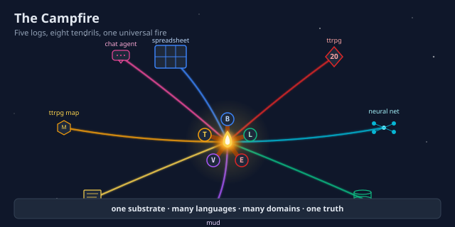
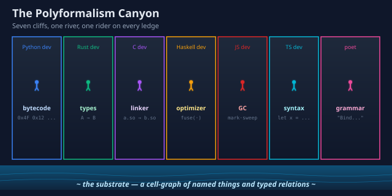
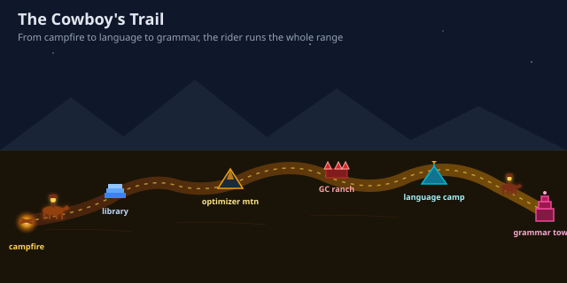
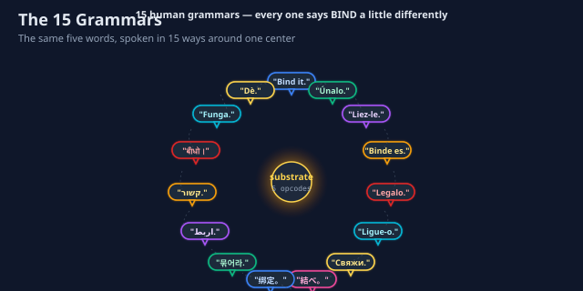
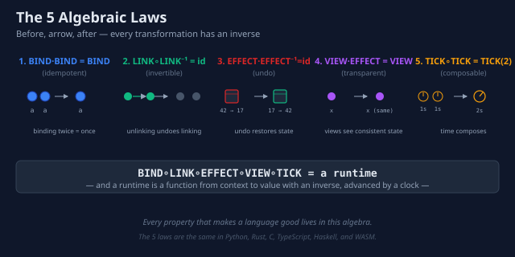
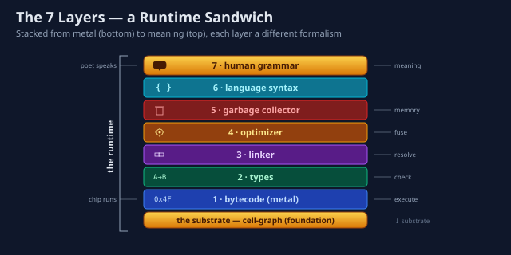
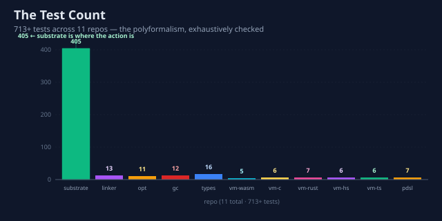
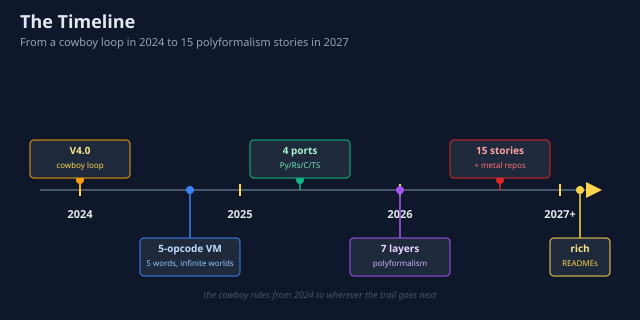

# The Polyformalism Gallery

> A visual tour of the quilt — the campfire, the canyon, the cowboy's
> trail, the 15 grammars, the 5 algebraic laws, the 7 stacked layers,
> the 713 tests, and the timeline that ties them all together.

This page is the **visual entry point** to the polyformalism. Every
diagram below is a self-contained SVG (640×320) that you can embed
in your own README, slide deck, or blog post. They are released under
the same MIT license as the code.

If you want the prose, start with the [main README](../README.md) and
the [substrate diagram](images/diagram-substrate.svg). If you want the
pictures, you are already in the right place.

---

## 1 · The Campfire

The campfire is the central metaphor. Five logs — `BIND`, `LINK`,
`EFFECT`, `VIEW`, `TICK` — burn at the center, and eight colored
tendrils of light reach out to eight different "camps" (spreadsheets,
TTRPGs, neural nets, databases, MUDs, Notion pages, TTRPG maps, chat
agents). The campfire is the same fire in every camp. The camps just
speak different languages about it.

  

---

## 2 · The Polyformalism Canyon

The polyformalism is not a slogan — it is a **geology**. Seven vertical
cliffs stand above a river called *the substrate*. Each cliff is a
different formalism (bytecode, types, linker, optimizer, GC, syntax,
grammar), and a different kind of person stands on each one looking
out: a Python dev on bytecode, a Rust dev on types, a C dev on the
linker, a Haskell dev on the optimizer, a JS dev on GC, a TS dev on
syntax, a poet on grammar. They are all looking at the same river.

  

---

## 3 · The Cowboy's Trail

The cowboy is the rider who moves through every layer and every
language. The trail is a winding path that runs from the campfire on
the left, through the library, up over the optimizer mountain, around
the GC ranch, into the language camp, and up to the grammar tower.
Two cowboys on horses mark the head and the tail of the trail.

  

---

## 4 · The 15 Grammars

The polyformalism extends across **15 human languages**, not just
15 programming languages. Around a central substrate, 15 speech
bubbles in 15 colors say the same instruction in 15 different tongues:
English *Bind it*, Spanish *Únalo*, French *Liez-le*, German
*Binde es*, Italian *Legalo*, Portuguese *Ligue-o*, Russian *Свяжи*,
Japanese *結べ*, Chinese *绑定*, Korean *묶어라*, Arabic *اربط*,
Hebrew *קשור*, Hindi *बाँधो*, Swahili *Funga*, Yoruba *Dè*. The
arrows between them are `LINK`s.

  

---

## 5 · The 5 Algebraic Laws

Every formalism has laws. Ours are five. `BIND` is idempotent
(binding twice equals binding once). `LINK` is invertible
(unlinking undoes linking). `EFFECT` has an inverse (undo restores
state). `VIEW` is referentially transparent (views see consistent
state). `TICK` composes (two ticks equal one tick of twice the
duration). These five laws together are a runtime.

  

---

## 6 · The 7 Layers, Stacked

A runtime is a sandwich. From metal at the bottom to meaning at the
top: bytecode, types, linker, optimizer, GC, syntax, grammar. Each
layer has a tiny picture of what it does. The top and bottom slices
of bread are the substrate (the foundation) and the human grammar
(the surface). Everything in between is the runtime.

  

---

## 7 · The Test Count

The polyformalism is not a hypothesis. It is **713+ tests across 11
repos**, and counting. `quilt-substrate` carries 405 of them — it is
where the action is. The five language ports (`vm-wasm`, `vm-c`,
`vm-rust`, `vm-haskell`, `vm-typescript`) each add a small handful.
The five metal-track tools (`linker`, `opt`, `gc`, `types`, `pdsl`)
add a few more. Every one of them speaks the same five opcodes.

  

---

## 8 · The Timeline

The polyformalism did not arrive in a flash. It is the result of a
trail: V4.0-cowboy-loop in 2024, the 5-opcode VM later that year, the
4 language ports in early 2025 (Python, Rust, C, TypeScript), the
7-layer polyformalism formalized in 2026, the 15 polyformalism
stories and metal-track repos late 2026, and the rich READMEs that
surround the whole thing in 2027. The cowboy rides forward.

  

---

## How to use these images

Every SVG in this gallery is a **self-contained, hand-authored** file.
You can:

- Embed it in a README with the standard
  `` pattern.
- Open it in any vector editor (Inkscape, Illustrator, Figma) and
  remix the colors or layout to match your own project.
- Print it at any size — the SVGs are resolution-independent and
  use the same dark-navy palette as the rest of the quilt
  documentation.

The color palette, in case you want to extend the gallery yourself:

| Color | Hex | Used for |
|-------|-----|----------|
| blue | `#3B82F6` | bytecode, BIND |
| green | `#10B981` | types, LINK |
| purple | `#A855F7` | linker, VIEW |
| orange | `#F59E0B` | optimizer, TICK |
| red | `#DC2626` | GC, EFFECT |
| cyan | `#06B6D4` | syntax |
| yellow | `#FCD34D` | the campfire itself |
| pink | `#EC4899` | grammar |

Background is always `#0F172A` (dark navy). Titles are `#E2E8F0`
(light slate). Body text is `#94A3B8` (muted slate).

---

*This gallery was drawn by the visual-assets subagent of the quilt
team. Every image is released under MIT, same as the code. If you
make a better one, send a PR.*
